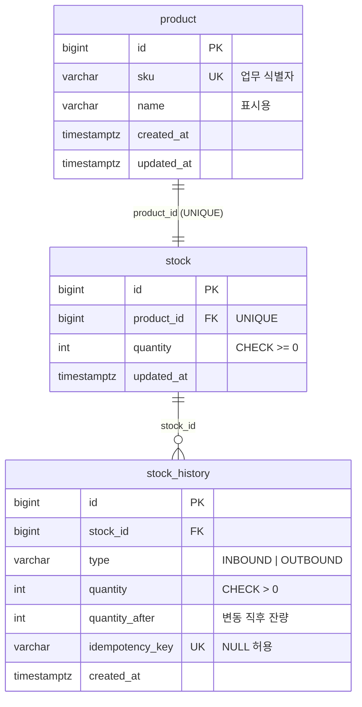

# inventory-service

[](https://github.com/heojungseok/Inventory-service/actions/workflows/ci.yml)

재고 관리 시스템의 MVP입니다. 상품의 입고·출고·재고 조회 API를 제공하며, **여러 요청이 동시에 들어와도 재고 수량이 어긋나지 않도록** 설계했습니다.

이 프로젝트가 목표로 하는 세 가지입니다.

- 상품의 현재 재고 수량 확인
- 입고 및 출고 처리 시 데이터 정합성 보장
- 동시 요청에 대한 안정적인 처리

## 목차

1. [구현 기능](#1-구현-기능)
2. [기술 스펙](#2-기술-스펙)
3. [실행 방법](#3-실행-방법)
4. [API](#4-api)
5. [DB 스키마](#5-db-스키마)
6. [설계 방향](#6-설계-방향)
7. [추후 고려 사항](#7-추후-고려-사항)

## 1. 구현 기능

### 요구사항

과제 요구사항을 항목별로 어떻게 구현했는지 정리했습니다.

| 구분 | 요구사항 | 구현 내용 | 확인 위치 |
|---|---|---|---|
| 공통 | 동시 입고·출고 요청에 대한 동시성 제어 | 재고 행 비관적 락(`SELECT ... FOR UPDATE`) | [6.2 동시 요청 처리](#동시-요청에-대한-안정적인-처리) |
| 공통 | 잘못된 요청에 적절한 에러 응답 | `{code, message, timestamp}` 형식, 400·404·409·500 | [4. API](#4-api) |
| 공통 | 기본 구조 `{id, name, quantity}`는 필요에 따라 변경 | `sku`를 더하고 product·stock·stock_history 세 테이블로 분리 | [5. DB 스키마](#5-db-스키마) |
| 입고 | 현재 재고 수량 증가 | `POST /api/v1/stocks/inbound` | `StockInboundUseCase` |
| 입고 | 등록되지 않은 상품이면 신규 등록 후 입고 | 같은 API에서 `sku` 기준으로 등록합니다. 동시에 신규 입고가 와도 상품은 1건만 생깁니다 | `ProductRegisterUseCase` |
| 출고 | 현재 재고 수량 감소 | `POST /api/v1/stocks/outbound` | `StockOutboundUseCase` |
| 출고 | 재고 수량은 음수가 될 수 없음 | 도메인 규칙(`Stock.decrease`)과 DB `CHECK` 제약 | `Stock` |
| 재고 | 현재 재고 수량 확인 | `GET /api/v1/products/{productId}/stock` | `StockQueryUseCase` |

### 추가 구현

요구사항에는 없지만 재고 시스템을 운영하려면 필요하다고 판단해 추가한 기능입니다.

| 기능 | 추가 이유 |
|---|---|
| 입출고 이력 조회 `GET /api/v1/products/{productId}/stock/histories` | 재고 숫자가 어떤 입출고를 거쳐 지금 값이 됐는지 추적할 수 있어야 운영 중 문의와 감사에 대응할 수 있습니다 |
| 멱등 키 `Idempotency-Key` 헤더 | 네트워크 타임아웃 뒤 클라이언트가 재시도했을 때 같은 입출고가 두 번 반영되는 것을 막습니다 |
| 재고 현황 목록 `GET /api/v1/stocks` | 상품별 단건 조회만으로는 전체 재고 상태를 한눈에 볼 수 없습니다 |

## 2. 기술 스펙

| 구분 | 내용 |
|---|---|
| 언어·프레임워크 | Java 21, Spring Boot 4.1.1, Spring Data JPA (Hibernate 7) |
| 데이터베이스 | PostgreSQL 17 |
| 스키마 관리 | Flyway |
| 입력 검증 | Bean Validation |
| API 문서 | springdoc-openapi 3.1.1 (Swagger UI) |
| 테스트 | JUnit 5, Testcontainers (실제 PostgreSQL 컨테이너) |
| CI | GitHub Actions (push·PR마다 전체 테스트) |
| 빌드 | Gradle (Groovy DSL) |

## 3. 실행 방법

Docker가 설치되어 있어야 합니다. 앱 실행과 테스트 실행은 서로 독립적이라 순서에 관계없이 진행할 수 있습니다.

### 앱 실행

1. PostgreSQL 컨테이너를 띄웁니다. `compose.yml`이 PostgreSQL 17을 `localhost:5432`에 올리며 DB 이름, 계정, 비밀번호는 모두 `inventory`입니다.

   ```bash
   docker compose up -d
   ```

2. 앱을 실행합니다. `9090` 포트에서 뜨고, 첫 기동 때 Flyway가 마이그레이션 파일을 순서대로 적용해 테이블을 만듭니다.

   ```bash
   ./gradlew bootRun
   ```

3. 브라우저에서 <http://localhost:9090/swagger-ui.html> 을 열면 API 문서를 보면서 요청을 직접 보낼 수 있습니다. 각 API의 요청 예시와 에러 코드를 문서에 적어 두었습니다.

이미 운영 중인 PostgreSQL을 쓰려면 환경 변수 `DB_URL`, `DB_USER`, `DB_PASSWORD`로 접속 정보를 바꿀 수 있습니다.

### 테스트 실행

```bash
./gradlew test
```

- Testcontainers가 테스트용 PostgreSQL 컨테이너를 직접 띄우고 내립니다. 위의 `compose.yml`과는 무관하며 Docker만 있으면 됩니다.
- Docker가 없는 환경에서는 [GitHub Actions 실행 결과](https://github.com/heojungseok/Inventory-service/actions)로 같은 테스트의 통과 여부를 확인할 수 있습니다.

## 4. API

기본 경로는 `/api/v1`입니다. 상세 스펙은 앱을 띄운 뒤 Swagger UI에서 볼 수 있고, 여기서는 전체 구성과 에러 응답 규칙만 정리합니다.

| 기능 | 메서드·경로 | 요청 | 성공 응답 |
|---|---|---|---|
| 입고 | `POST /stocks/inbound` | `{sku, name?, quantity}` | `200` 재고 응답 |
| 출고 | `POST /stocks/outbound` | `{sku, quantity}` | `200` 재고 응답 |
| 재고 조회 | `GET /products/{productId}/stock` | - | `200` 재고 응답 |
| 재고 현황 목록 | `GET /stocks?page=0` | sku 오름차순, 한 페이지 20개 | `200` 페이지 응답 |
| 입출고 이력 | `GET /products/{productId}/stock/histories?page=0&size=20` | 최신순 고정, size 최대 100 | `200` 페이지 응답 |

입고와 출고는 선택 헤더 `Idempotency-Key`를 받습니다. 같은 키로 다시 보내면 **처음 응답을 그대로 돌려주고 재고는 건드리지 않습니다.**

### 요청·응답 예시

입고 요청입니다. `name`은 처음 보는 `sku`일 때만 필수이고, 이미 등록된 상품이면 무시됩니다.

```json
{ "sku": "SKU-A001", "name": "무선 마우스", "quantity": 10 }
```

재고 응답입니다. 요구사항의 `{id, name, quantity}`에 `sku`를 더했습니다.

```json
{ "id": 1, "sku": "SKU-A001", "name": "무선 마우스", "quantity": 10 }
```

이력 응답입니다. `quantityAfter`는 그 입출고 직후의 재고 수량입니다.

```json
{
  "content": [
    { "type": "OUTBOUND", "quantity": 3, "quantityAfter": 7, "createdAt": "2026-09-24T09:12:31.204Z" },
    { "type": "INBOUND",  "quantity": 10, "quantityAfter": 10, "createdAt": "2026-09-24T09:10:02.118Z" }
  ],
  "page": { "size": 20, "number": 0, "totalElements": 2, "totalPages": 1 }
}
```

### 에러 응답

모든 에러는 같은 형식으로 내려갑니다. 클라이언트는 `code`로 에러 종류를 구분하고, `message`는 화면이나 로그에 그대로 보여 줄 수 있는 설명입니다.

```json
{ "code": "INSUFFICIENT_STOCK", "message": "재고가 부족합니다.", "timestamp": "2026-09-24T09:15:40.771Z" }
```

| 상태 | code | 발생 상황 |
|---|---|---|
| 400 | `INVALID_REQUEST` | 검증 실패(sku 공백, quantity ≤ 0, 길이 초과, 신규 상품인데 name 없음), 깨진 JSON, 잘못된 경로 값 |
| 404 | `PRODUCT_NOT_FOUND` | 없는 상품으로 출고·조회 |
| 409 | `INSUFFICIENT_STOCK` | 출고 수량이 재고보다 많은 경우. 재고는 바뀌지 않습니다 |
| 409 | `IDEMPOTENCY_CONFLICT` | 같은 멱등 키로 내용이 다른 요청을 보낸 경우 |
| 500 | `INTERNAL_ERROR` | 처리하지 못한 예외. 서버 로그에 스택을 남기고 클라이언트에는 원인을 노출하지 않습니다 |

## 5. DB 스키마

DDL은 Flyway 마이그레이션 파일로 대체합니다. 스키마는 이 파일들을 기준으로 관리하며, **테이블의 생성과 변경은 모두 마이그레이션 파일을 통해서만** 이루어집니다.

| 파일 | 변경 내용 | 관련 기능 |
|---|---|---|
| [`V1__init.sql`](src/main/resources/db/migration/V1__init.sql) | product, stock, stock_history 테이블과 이력 조회 인덱스 생성 | 입고, 출고, 재고 조회, 이력 조회 |
| [`V2__add_idempotency_key.sql`](src/main/resources/db/migration/V2__add_idempotency_key.sql) | stock_history에 멱등 키 컬럼 추가 | 멱등 키 |

> V1이 로컬 DB에 적용된 뒤 멱등 키를 추가했기 때문에 V1을 고치지 않고 V2를 만들었습니다. **이미 적용된 마이그레이션 파일은 수정하지 않는다**는 원칙을 과제에서도 지켰습니다.

JPA 설정은 `ddl-auto: validate`입니다. 엔티티와 실제 스키마가 어긋나면 앱이 기동 단계에서 멈추기 때문에, 코드와 DB가 다른 채로 운영되는 상황을 막습니다.



### 기본 구조 `{id, name, quantity}`를 바꾼 이유

요구사항은 상품 하나에 수량 하나가 붙는 구조였습니다. 세 가지 이유로 구조를 바꿨습니다.

| 변경 | 이유 |
|---|---|
| `sku` 추가 | "등록되지 않은 상품"을 판단하려면 업무에서 쓰는 식별자가 필요합니다. 상품명은 바뀔 수 있고 중복될 수 있어 식별자로 쓰기 어렵고, `id`는 서버가 만드는 값이라 클라이언트가 입고 시점에 알 수 없습니다 |
| product와 stock 분리 | 입출고는 stock 행만 잠급니다. 상품명 수정 같은 카탈로그 변경이 재고 락과 부딪히지 않습니다 |
| stock_history 추가 | 현재 수량만 저장하면 그 숫자가 어떻게 나왔는지 알 수 없습니다. 이력은 **수정·삭제하지 않는 원장**으로 두고, `quantity_after`에 변동 직후 잔량을 함께 남겨 어느 시점의 재고든 다시 계산하지 않고 읽을 수 있게 했습니다 |

멱등 키를 별도 테이블이 아니라 이력에 둔 것은, 키가 "어느 요청으로 생긴 이력인지"를 가리키는 참조이기도 하기 때문입니다. UNIQUE 컬럼 하나로 재시도를 막으면서 추적 정보도 함께 남깁니다.

재고 수량의 `CHECK (quantity >= 0)` 제약은 애플리케이션이 음수를 거르지 못한 경우에도 **DB가 저장을 거부**하도록 둔 것입니다. 규칙은 도메인 객체에 있지만, 그 규칙을 우회하는 코드가 생기더라도 데이터 정합성이 무너지지 않게 하기 위해서입니다.

<details>
<summary>이력 테이블 활용 예시 SQL</summary>

통계 API는 만들지 않았지만, 이력 테이블만으로 다음과 같은 운영 지표를 바로 조회할 수 있습니다.

```sql
-- 특정 시점의 재고: quantity_after 덕분에 그 시점까지의 입출고를 다시 더하지 않아도 됩니다
SELECT quantity_after
FROM stock_history
WHERE stock_id = :stockId AND created_at <= :at
ORDER BY created_at DESC, id DESC
LIMIT 1;

-- 일별 출고량
SELECT date(created_at) AS day, sum(quantity) AS outbound
FROM stock_history
WHERE type = 'OUTBOUND' AND created_at >= :from
GROUP BY day
ORDER BY day;
```

</details>

## 6. 설계 방향

### 6.1 구조

단일 모듈 안에서 기능(`product`, `stock`)별로 패키지를 나누고, 각 기능 안에서 다시 계층을 나눴습니다.



확대·검색·경로 추적이 되는 [인터랙티브 버전](docs/architecture.html)은 파일을 내려받아 브라우저로 열면 됩니다.

```text
com.example.inventory
├── global
│   ├── config        JPA Auditing, Swagger 설정
│   ├── exception     ErrorCode, BusinessException, GlobalExceptionHandler
│   └── response      ErrorResponse
├── product
│   ├── app           ProductRegisterUseCase
│   ├── domain        Product, ProductNotFoundException
│   └── out           ProductRepository
└── stock
    ├── in            StockController, 요청·응답 DTO
    ├── app           StockInboundUseCase, StockOutboundUseCase, StockQueryUseCase,
    │                 StockHistoryQueryUseCase, StockIdempotencyChecker
    ├── domain        Stock, StockHistory, InsufficientStockException
    └── out           StockRepository, StockHistoryRepository
```

의존 방향은 `in → app → domain ← out`입니다. 각 계층의 역할은 다음과 같습니다.

- `in`은 HTTP를 아는 유일한 계층입니다. 요청 DTO를 풀어 값으로 `app`에 넘기고, `out`을 직접 부르지 않습니다.
- `app`은 사용자의 행위(입고한다, 출고한다, 재고를 본다)를 하나씩 클래스로 옮긴 계층입니다. 클래스 이름이 곧 기능 목록이 되고, 한 행위의 흐름(재고 행 잠금 → 규칙 실행 → 이력 저장)이 한 클래스 안에서 끝납니다. 업무 규칙은 갖지 않습니다.
- `domain`은 HTTP, 트랜잭션, DB 접근 방법을 모릅니다. 다른 계층에 의존하지 않고 업무 규칙만 갖습니다. "재고는 음수가 될 수 없다", "입출고 수량은 1 이상이다" 같은 규칙은 **`Stock.increase()`와 `Stock.decrease()`에만** 있습니다.
- `out`은 DB 접근을 담당합니다. 락을 거는 조회도 여기에 있습니다.
- 예외는 규칙이 있는 곳에 둡니다. 재고 부족은 `stock.domain`, 상품 없음은 `product.domain`, 요청 형식 오류와 공통 처리는 `global`입니다.

### 6.2 과제 목표별 설계

#### 상품의 현재 재고 수량 확인

재고 조회는 호출 빈도가 가장 높을 것으로 보고, 데이터가 늘어나거나 요청 파라미터가 달라져도 **SQL 횟수와 읽는 행 수가 일정한 범위를 넘지 않도록** 설계했습니다.

- `stock`과 `product`를 fetch join으로 한 번에 읽어 상품 수만큼 쿼리가 늘어나는 N+1 문제를 막았습니다. 목록 조회는 목록과 건수 두 번의 SQL로 끝납니다.
- 재고 현황 목록의 페이지 크기는 이 과제에서 임의로 20으로 정했습니다. 클라이언트가 페이지 크기와 정렬을 바꾸지 못하게 해서, 인덱스가 없는 정렬이나 지나치게 큰 페이지 요청이 DB까지 전달되지 않도록 했습니다.
- 이력 조회는 `(stock_id, created_at DESC)` 인덱스를 타며, 페이지 크기는 최대 100으로 제한했습니다.

#### 입고·출고 처리 시 데이터 정합성 보장

재고가 바뀌었는데 이력이 없거나, 이력은 있는데 재고가 안 바뀐 상태가 생기지 않아야 합니다.

- 입고와 출고는 각각 한 트랜잭션입니다. 재고 행 잠금, 수량 변경, 이력 저장이 **함께 커밋되거나 함께 롤백됩니다.**
- 수량 변경은 `Stock` 엔티티의 두 메서드에서만 일어납니다. 규칙이 한 곳에 있어 유스케이스가 늘어나도 규칙을 우회할 수 없습니다.
- 미등록 상품 입고는 `INSERT ... ON CONFLICT DO NOTHING`으로 상품과 재고 행을 만듭니다. 같은 sku로 신규 입고가 동시에 와도 상품은 하나만 생기고, 늦게 도착한 요청은 실패하지 않고 먼저 만들어진 재고에 더해집니다. 신규 상품과 기존 상품을 나누는 분기가 필요 없어집니다.
- 실패한 요청은 롤백되어 이력도 멱등 키도 남지 않습니다. 재시도하면 처음부터 다시 판단합니다.

이 항목의 확인은 API 통합 테스트 16개가 담당합니다. 입고 후 조회, 재고 부족 시 409와 수량 유지, 신규 상품 등록, 검증 실패 400을 확인합니다.

#### 동시 요청에 대한 안정적인 처리

같은 상품에 출고 요청이 동시에 들어오면, 락이 없을 때는 서로의 변경을 덮어써서 재고가 실제보다 많이 남거나 음수 판정을 놓칠 수 있습니다.

**비관적 락을 선택했습니다.** 입출고는 `stock` 행을 `SELECT ... FOR UPDATE`로 잠근 뒤 수량을 바꿉니다 (`StockRepository.findByProductIdForUpdate`, JPA `@Lock(PESSIMISTIC_WRITE)`). **락은 애플리케이션이 아니라 DB 행에 걸리므로**, 같은 상품에 대한 요청은 스레드나 서버 수와 관계없이 DB에서 순서대로 처리되고, 다른 상품끼리는 서로 기다리지 않습니다.

선택 전에 네 가지 방식을 비교했습니다.

| 방식 | 장점 | 과제에서 고르지 않은 이유 |
|---|---|---|
| 비관적 락 (선택) | 충돌이 잦은 데이터에 안정적입니다. 규칙을 도메인 객체에 둘 수 있습니다 | - |
| 낙관적 락 (`@Version`) | 충돌이 드물면 락 대기가 없습니다 | 재고는 같은 상품에 요청이 몰리는 경우가 많다고 보고, 그때 재시도가 크게 늘어납니다 |
| 원자적 UPDATE (`SET quantity = quantity - ? WHERE quantity >= ?`) | 가장 빠릅니다 | 규칙이 SQL로 흩어지고, 이력의 `quantity_after`를 얻으려면 한 번 더 읽어야 합니다 |
| Redis 분산 락 | DB가 여러 대여도 동작합니다 | DB가 하나인 현재는 운영할 인프라만 늘어납니다 |

**락을 거는 코드는 `StockRepository` 메서드 한 곳입니다.** 트래픽이 몰려 다른 방식으로 바꿔야 할 때 교체 지점이 명확합니다.

추가 구현인 멱등 키는 락과 다른 문제를 풉니다. 락은 **"서로 다른 요청이 동시에"** 오는 경우를, 멱등 키는 **"같은 요청이 재시도로 여러 번"** 오는 경우를 다룹니다.

- 클라이언트가 요청마다 고유한 `Idempotency-Key`를 만들고, 타임아웃 뒤 재시도할 때만 같은 키를 다시 보냅니다.
- 서버는 stock 락을 잡은 뒤 키로 이력을 찾습니다. 같은 요청(같은 상품·유형·수량)이면 그 이력의 `quantity_after`로 처음 응답을 재현하고, 다른 요청이면 `409 IDEMPOTENCY_CONFLICT`를 돌려줍니다.
- 락을 잡은 뒤에 확인하기 때문에, 같은 키의 재시도가 동시에 몰려도 별도의 동시성 장치 없이 한 번만 반영됩니다.

확인은 HTTP 요청 단위로 했습니다. `StockConcurrencyTest`는 `ExecutorService`와 `CountDownLatch`로 요청을 모두 준비시킨 뒤 한 번에 출발시켜 실제로 겹치게 만듭니다.

| 시나리오 | 기대 결과 | 결과 |
|---|---|---|
| 재고가 100개인 상품에 1개씩 출고를 150건 동시 요청 | 성공 100건, `409` 50건, 잔량 0 | 통과 |
| 등록되지 않은 sku로 1개씩 입고를 20건 동시 요청 | 상품 1건, 재고 20 | 통과 |
| 같은 멱등 키를 붙여 1개씩 출고를 10건 동시 요청 | 10건 모두 `200`, 재고는 한 번만 줄어 99 | 통과 |

전체 테스트는 24개입니다. 도메인 규칙 단위 테스트 4개, API 통합 테스트 16개, 동시성 테스트 3개, 앱 기동 1개입니다.

### 6.3 확장성

기능을 미리 만들어 두는 대신, 기능이 들어올 때 **변경이 한 곳에서 끝나도록 경계를 그었습니다.**

- 기능별 패키지와 단방향 참조를 지켰습니다. `stock → product` 한 방향만 참조하고 `Product`는 `Stock`을 모릅니다. 멀티 모듈로 나눌 때 패키지를 모듈로 옮기는 것으로 끝납니다.
- 동시성 전략의 교체 지점이 한 곳입니다. 6.2의 비교 표에 있는 다른 방식으로 바꿔도 `StockRepository`의 락 메서드만 바뀌고 유스케이스 코드는 그대로입니다.
- 재고를 나누는 기준이 늘어나도 스키마를 새로 만들지 않아도 됩니다. 예를 들어 보관 창고별 재고가 필요해지면 stock에 `warehouse_id`를 더하고 UNIQUE를 `(product_id, warehouse_id)`로 바꾸면 됩니다. 1:1 관계를 JPA가 아닌 DDL 제약에만 둔 이유입니다.
- 이력이 원장 역할을 합니다. 통계, 감사, 특정 시점 재고 복원이 이 테이블 하나로 가능합니다.

### 6.4 유지보수성

코드와 문서, 코드와 DB가 서로 어긋난 채로 남지 않도록 했습니다.

- 계층을 나눠 두어 변경 위치가 예측됩니다. HTTP 요청·응답 형식이 바뀌면 `in`만, 업무 규칙이 바뀌면 `domain`만 고칩니다.
- 스키마 변경은 Flyway 버전 파일로 남깁니다. 엔티티와 어긋나면 `validate` 설정이 기동 때 잡습니다.
- 에러 정의와 응답 형식을 `ErrorCode` enum 한 곳에서 관리합니다. 코드, HTTP 상태, 메시지가 함께 있어서 새 에러를 추가할 때 핸들러를 고치지 않아도 됩니다.
- API 문서는 컨트롤러 애노테이션으로 작성했습니다. 요청 예시와 에러 코드가 코드와 같은 파일에 있어서, 코드가 바뀌었는데 문서만 오래된 상태로 남는 일을 줄입니다.
- 테스트는 Testcontainers로 띄운 PostgreSQL에서 실행됩니다. 락, 제약, upsert가 운영과 같은 조건에서 검증됩니다.
- CI에서 push마다 전체 테스트가 돌고 결과가 배지로 보입니다.

## 7. 추후 고려 사항

아래는 MVP에서 의도적으로 넣지 않은 항목입니다. 각 항목은 전환 조건이 실제로 생겼을 때 검토하며, **그 전에는 지금 구조를 유지합니다.** 변경 범위 칸은 지금 설계가 그 확장을 막지 않는다는 근거입니다.

| 전환 조건 | 검토 설계 | 변경 범위 |
|---|---|---|
| 특정 상품에 트래픽이 몰려 락 대기가 응답 시간의 대부분을 차지하거나, DB가 여러 대로 늘어나 DB 락으로 순서를 보장할 수 없을 때 | 동시성 제어 방식 전환을 검토합니다. 전자는 원자적 UPDATE(`UPDATE ... WHERE quantity >= ?`)로 락 대기를 없애고, 후자는 Redis 분산 락으로 상품별 순서를 잡습니다 | `StockRepository`의 락 메서드 한 곳. 원자적 UPDATE는 이력의 `quantity_after`를 얻는 조회가 한 번 추가되고, 분산 락은 Redis 인프라와 락 만료·재시도 정책이 추가됩니다 |
| 재시도 시 응답 전체를 재현해야 하거나 멱등 키에 만료가 필요해질 때 | 멱등 키 전용 테이블을 검토합니다. 키, 요청 지문, 응답 JSON, 상태, 만료 시각을 별도 테이블에 둡니다 | `StockIdempotencyChecker`가 조회하는 테이블만 바뀝니다. 헤더 계약이 같아 클라이언트 변경은 없습니다 |
| 이력이 수천만 건으로 늘어 조회와 보관 비용이 부담될 때 | 이력 테이블 분리를 검토합니다. 월별 파티셔닝을 먼저 적용하고, 그다음 별도 저장소로 옮깁니다 | `stock_history`가 다른 테이블의 참조를 받지 않아 분리 대상이 이 테이블 하나로 한정됩니다 |
| 입출고 결과를 외부 시스템(주문, 알림, 데이터 파이프라인)에 전달해야 하고, 재고는 반영됐는데 전달만 누락되는 일이 허용되지 않을 때 | Outbox 패턴을 검토합니다. 재고 변경과 같은 트랜잭션에서 이벤트를 저장해 두고 별도 프로세스가 발행하므로, 발행이 실패해도 재고 반영은 유지되고 이벤트만 다시 시도합니다 | 유스케이스에 이벤트 저장 한 줄이 추가됩니다. 이벤트의 원천은 `stock_history`를 그대로 쓰거나 별도의 `outbox` 테이블을 추가하는 두 가지 방법이 있습니다 |
| 상품과 재고가 서로 다른 팀·모듈의 책임이 되어 직접 호출을 끊어야 할 때 | 모듈 간 이벤트 공유를 검토합니다. `ProductRegistered` 같은 도메인 이벤트로 product와 stock이 통신합니다. MVP에서는 컨텍스트가 하나라 직접 호출이 더 단순하다고 판단해 넣지 않았습니다 | `StockInboundUseCase`가 `ProductRegisterUseCase`를 직접 부르는 부분이 이벤트 발행·구독으로 바뀝니다 |
| 코드가 커져 팀별로 빌드·배포 단위를 나눠야 할 때 | 멀티 모듈 분리를 검토합니다. `product`, `stock`을 각각 모듈로, `global`을 공통 모듈로 나눕니다. MVP에서는 모듈 경계를 관리하는 비용이 얻는 이점보다 크다고 판단해 단일 모듈로 두었습니다 | 단방향 참조를 지켜 두어 패키지 이동과 Gradle 설정 추가로 끝납니다 |
